# Food Delivery App

[](https://reactnative.dev)
[](https://expo.dev)
[](https://github.com/pmndrs/zustand)
[](https://www.typescriptlang.org)
[](https://opensource.org/licenses/MIT)

A cross-platform food delivery mobile application built using React Native, Expo, and TypeScript. This repository demonstrates standard navigation architectures, state persistence, global state synchronization, custom animated overlay systems, and deep linking configurations in mobile clients.

---

## 📝 Table of Contents

- [About the Project](#-about-the-project)
- [Key Features](#-key-features)
- [Screenshots Showcase](#-screenshots-showcase)
- [Tech Stack](#-tech-stack)
- [Project Directory Structure](#-project-directory-structure)
- [Getting Started](#-getting-started)
  - [Prerequisites](#prerequisites)
  - [Installation](#installation)
  - [Running the App](#running-the-app)
- [Navigation Architecture](#-navigation-architecture)
- [Deep Linking Configuration](#-deep-linking-configuration)
  - [Testing Links](#testing-links)
- [Assumptions & Mock Implementations](#-assumptions--mock-implementations)
- [License](#-license)

---

## 📖 About the Project

This application implements the complete user checkout funnel inspired by modern food delivery applications (e.g., Zomato, Swiggy, UberEats). It handles user onboarding, authentication validation, interactive restaurant search, dynamic item quantity selection, single-restaurant cart constraints, order generation, and offline-first state persistence.

---

## ✨ Key Features

- **Robust Multi-Navigator Setup**: Combines nested stacks, a bottom tab bar, and a custom interactive profile drawer to facilitate complex navigation without performance degradation.
- **State-Synchronized Cart**: Uses a global Zustand store to manage real-time cart counts, price calculation, and order tracking. Restricts users from adding menu items from different restaurants concurrently.
- **Dynamic Tab Notifications**: Displays an interactive cart badge on the bottom navigation bar sync'd instantly with state updates.
- **Local Session Persistence**: Automatically caches authentication profiles locally, allowing users to remain logged in across complete app restarts.
- **Animated Drawer Menu**: A custom, lightweight animated overlay slide-in menu that houses user settings, purchase history shortcuts, and session terminators.

---

## 📸 Screenshots Showcase

#### 🚀 Onboarding & Authentication
| Splash Screen | Welcome Onboarding | Authentication / Login | Account Sign-up |
| :---: | :---: | :---: | :---: |
| 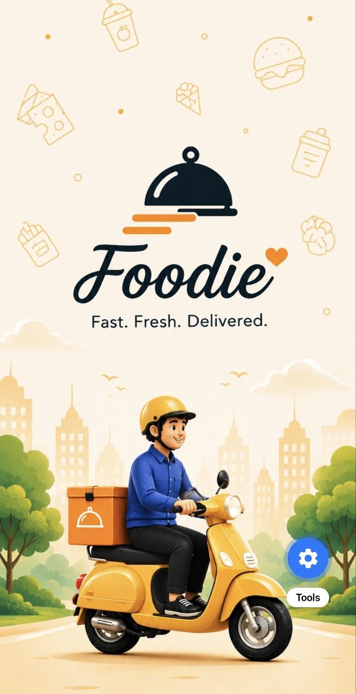 | 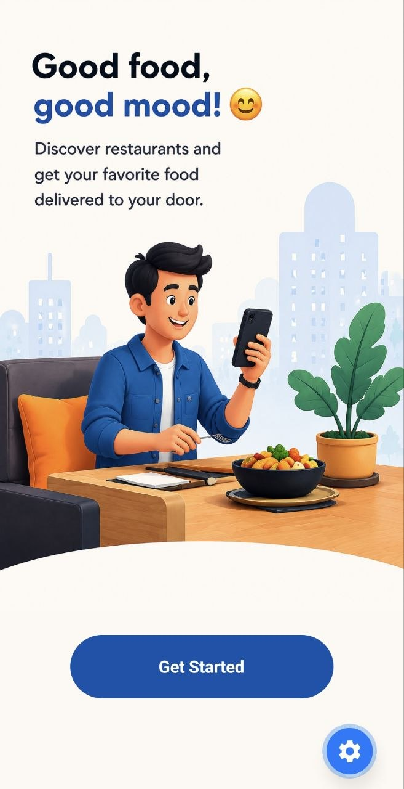 | 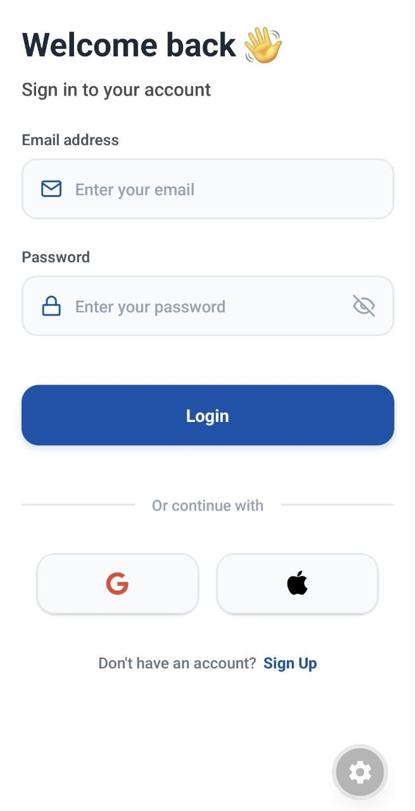 | 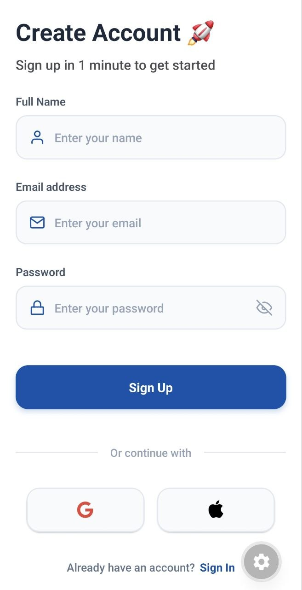 |

#### 🍔 Food Discovery & Ordering
| Home Feed | Search & Filter | Restaurant Menu | Custom Options |
| :---: | :---: | :---: | :---: |
| 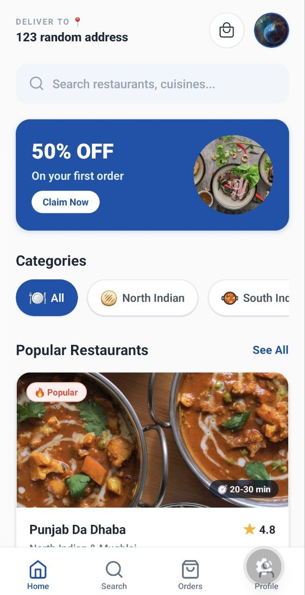 | 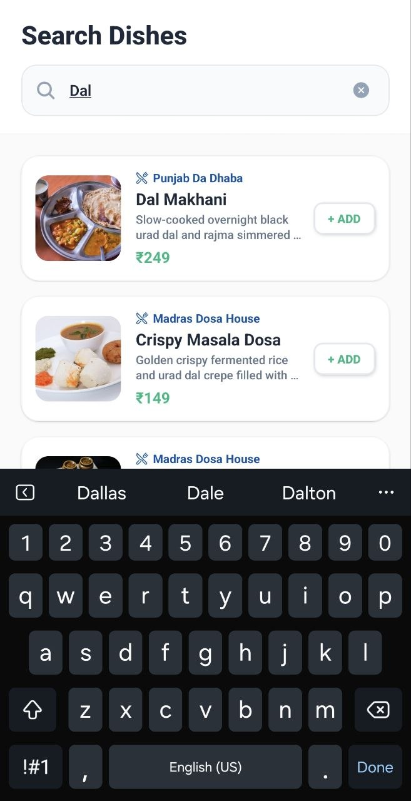 | 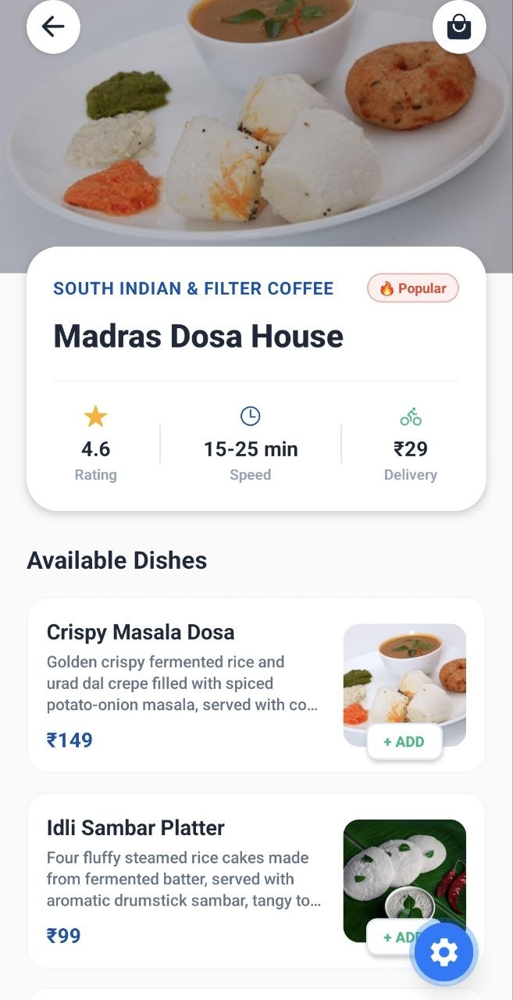 | 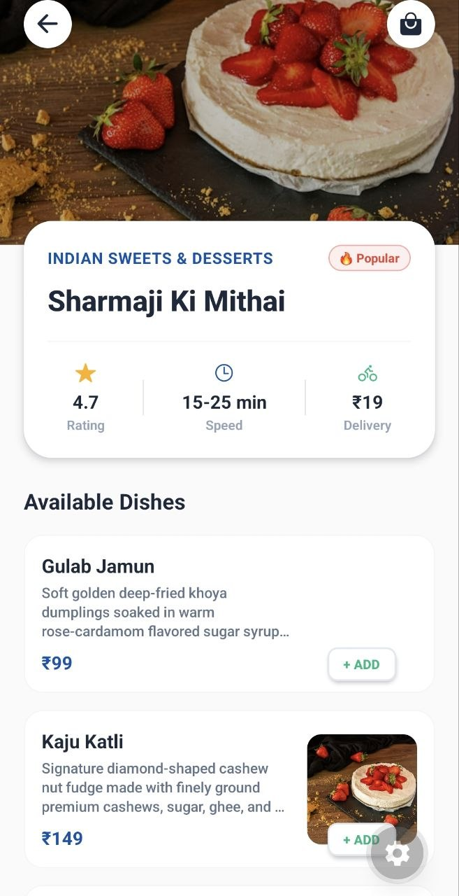 |

#### 🛒 Cart & Checkout Funnel
| Cart Summary | Cart Constraints Alert | Place Order | Order Confirmed! |
| :---: | :---: | :---: | :---: |
|  | 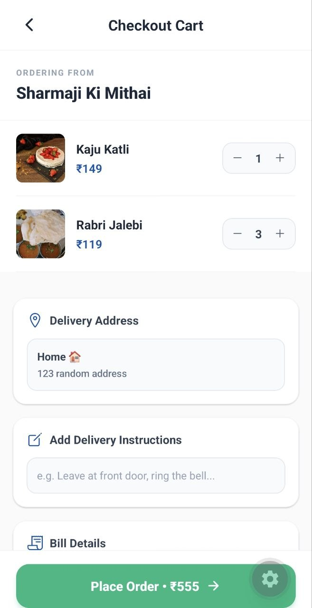 | 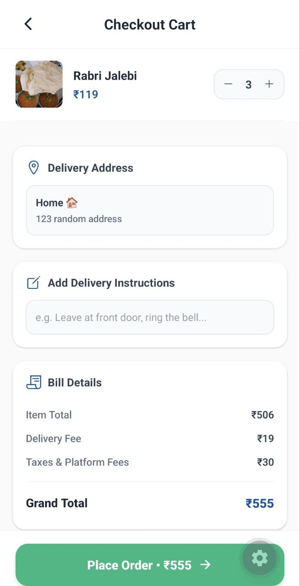 | 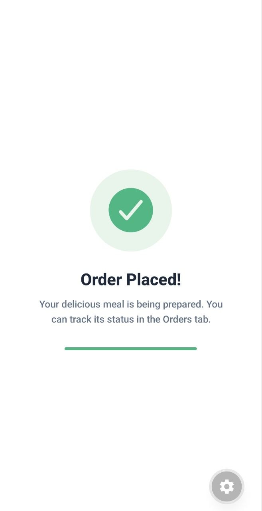 |

#### 📋 Profile & Drawer Navigation
| Custom Slide-out Drawer | Profile Details | Edit Profile / Options |
| :---: | :---: | :---: |
| 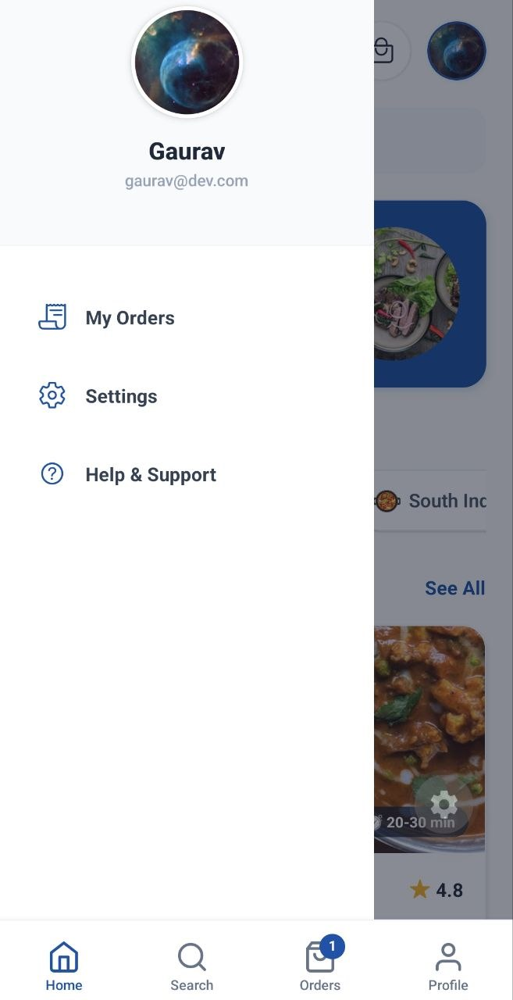 | 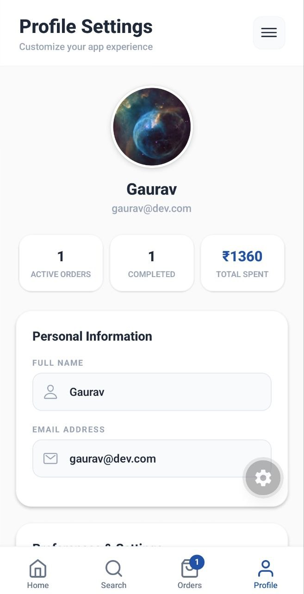 | 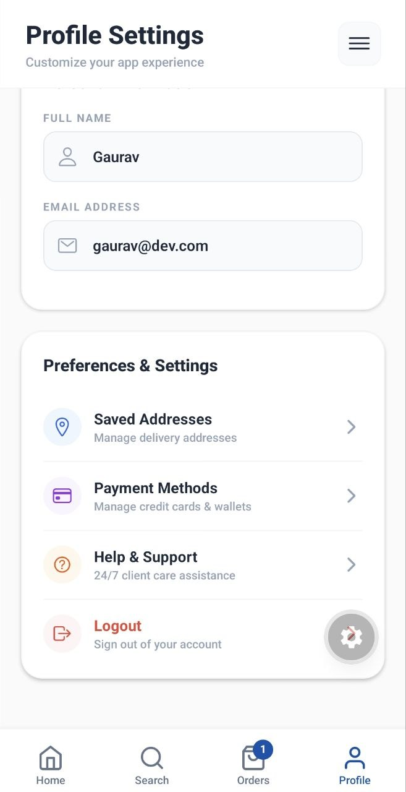 |

#### 📦 My Orders Tracking
| Order History | Order Detail 1 | Order Detail 2 |
| :---: | :---: | :---: |
| 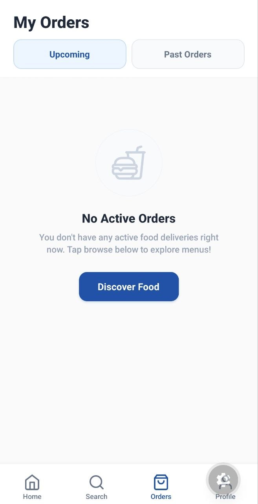 | 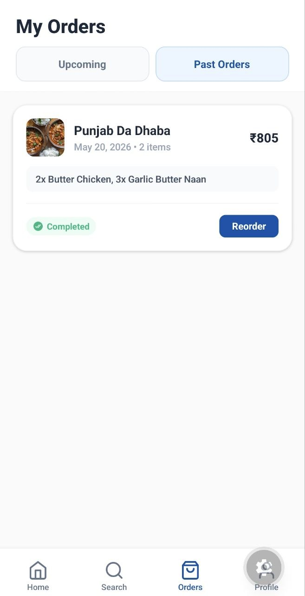 | 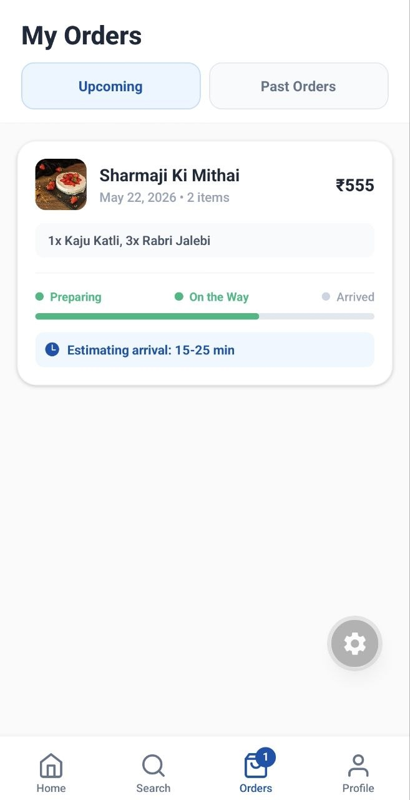 |

---

## 🛠️ Tech Stack

| Layer | Dependency | Description |
|:---|:---|:---|
| **Core Framework** | Expo SDK 55.0.26 | Bundler, CLI environment, and native bindings. |
| **Runtime Environment** | React Native 0.83.6 & React 19.2.0 | Cross-platform framework & UI rendering layer. |
| **State Management** | Zustand ^5.0.13 | Global client-side store managing data bindings. |
| **Local Cache** | AsyncStorage ^2.2.0 | Device disk storage for persisting logins and state. |
| **Navigation** | React Navigation v7 | Stack and Tab system handlers. |
| **Vector Icons** | Feather & Ionicons (Expo Vector Icons) | Icon library. |
| **Language** | TypeScript ~5.9.2 | Codebase compiler and static type analyzer. |
| **Package Manager** | Bun | High-performance Javascript utility manager. |

---

## 📂 Project Directory Structure

```text
foodApp/
├── assets/                  # App images, icons, onboarding art, and splash screens
├── src/
│   ├── components/          # Reusable UI components
│   │   ├── CategorySelector.tsx
│   │   ├── DishRow.tsx
│   │   ├── HomeHeader.tsx
│   │   ├── InputBox.tsx
│   │   ├── ProfileDrawerOverlay.tsx
│   │   ├── RestaurantCard.tsx
│   │   ├── SearchBar.tsx
│   │   └── ...
│   ├── constants/           # Color palettes and static mockup listings
│   │   ├── colors.ts
│   │   └── restaurants.ts
│   ├── Navigation/          # Navigation configurations
│   │   ├── AuthStack.tsx    # Flow: Onboarding, Login, Signup
│   │   ├── MainStack.tsx    # Flow: Home, Restaurant menu detail, Cart Checkout
│   │   ├── MainTab.tsx      # Tab bar navigation shell
│   │   ├── ProfileDrawer.tsx# Custom overlay drawer container
│   │   └── RootStack.tsx    # Entry gate check (Auth vs Unauth)
│   ├── screens/             # Screen layouts
│   │   ├── Auth/            # Login, Signup
│   │   ├── Onboarding/      # Splash, Welcome carousel
│   │   ├── tabs/            # Home, Search, Orders, Profile
│   │   ├── Cart.tsx         # Delivery invoice details
│   │   └── Restaurant.tsx   # Menu details screen
│   ├── store/               # Global state manager
│   │   └── store.ts         # Zustand hooks and actions
│   └── utilities/           # Shared helper routines
│       └── asyncStorage.ts  # AsyncStorage interface wrapper
├── App.tsx                  # React Entrypoint and Deep Linking routing configuration
├── app.json                 # Expo Project manifest metadata
└── package.json             # NPM dependencies registry
```

---

## 🚀 Getting Started

Follow these instructions to run a local development copy.

### Prerequisites
- Node.js LTS (v18+) installed on your local development machine.
- Bun (or npm) for package installation.
- Android Studio (for Android emulator), Xcode (for iOS simulator), or a physical mobile device with **Expo Go** installed.

### Installation

1. Clone the repository:
   ```bash
   git clone https://github.com/your-username/foodapp.git
   cd foodapp
   ```

2. Install the application dependencies:
   ```bash
   bun install
   # or: npm install
   ```

### Running the App

1. Initialize the Expo CLI server:
   ```bash
   bun start
   # or: npm run start
   ```

2. Boot the client on an emulator or active terminal target:
   - Press **`a`** for Android Emulator.
   - Press **`i`** for iOS Simulator.
   - Scan the terminal's **QR Code** using your phone to open the application directly in **Expo Go**.

---

## 🗺️ Navigation Architecture

```text
                  [ App.tsx / NavigationContainer ] (Deep Linking Enabled)
                                  │
                                  ▼
                            [ RootStack ] (Conditional Switch)
                                  │
      ┌───────────────────────────┼───────────────────────────┐
      ▼                           ▼                           ▼
[ SplashScreen ]           [ AuthStack ] (Unauthenticated)  [ MainTab ] (Authenticated)
(Auth Persistence load)    (Onboarding Switch)                │ (Tab Bar Active, Badge on Orders)
                                  │                           │
                   ┌──────────────┴──────────────┐            ├─────────────────┬──────────────┬──────────────┐
                   ▼                             ▼            ▼                 ▼              ▼              ▼
            [ Onboarding ]                 [ LoginStack ]  [ Home Tab ]    [ Search Tab ]  [ Orders Tab ] [ Profile Tab ]
            (Get Started)                  (Login/Signup)     │                 │              │              │
                                                              ▼                 ▼              ▼              ▼
                                                        [ MainStack ]      [ Search ]      [ Orders ]   [ ProfileDrawer ]
                                                        (Hides Tab Bar on detail views)                 (Custom Drawer overlay)
                                                              │                                               │
                                       ┌──────────────────────┼──────────────────────┐        ┌───────────────┼───────────────┐
                                       ▼                      ▼                      ▼        ▼               ▼               ▼
                                   [ Home ]             [ Restaurant ]            [ Cart ] [ Profile ]  [ Settings ] [ Logout/Help ]
                                  (Feed Card)           (Menu Detail)           (Checkout)
```

### Flow Details

1. **Root Switch Layer**: Checks the persistence cache for a session token during `SplashScreen`. If detected, routes the user immediately to `MainTab`; otherwise, opens `AuthStack`.
2. **Tab Bar Display Controls**: Inside `MainTab`, the tab bar automatically hides when users navigate deep into a restaurant menu or checkout screens (`Restaurant` or `Cart`), maximizing usable layout real estate.
3. **Programmatic Tab Redirection**: Tapping items in the drawer (e.g., *My Orders*) programmatically shifts active tabs, closing the modal overlay instantly.

---

## 🔗 Deep Linking Configuration

The application includes absolute deep linking configurations to support deep-routed marketing flows and inter-app transitions.

- **Custom Scheme**: `foodapp://`
- **Universal Link**: `https://foodapp.com`

### Route Mappings
Routes inside `App.tsx` map external URLs directly to nested screens:
- `foodapp://app/home` ➔ Home Screen
- `foodapp://app/home/restaurant/:id` ➔ Restaurant Menu Detail (e.g. `foodapp://app/home/restaurant/1` opens restaurant with ID 1)
- `foodapp://app/orders` ➔ Orders Dashboard
- `foodapp://app/profile` ➔ Profile Dashboard

### Testing Links

Make sure your development bundler is running, then run one of the following testing commands:

#### Android Simulator
```bash
npx uri-scheme open foodapp://app/home/restaurant/1 --android
```
*Alternative via ADB:*
```bash
adb shell am start -W -a android.intent.action.VIEW -d "foodapp://app/home/restaurant/1" com.foodapp
```

#### iOS Simulator
```bash
npx uri-scheme open foodapp://app/home/restaurant/1 --ios
```
*Alternative via simctl:*
```bash
xcrun simctl openurl booted foodapp://app/home/restaurant/1
```

---

## 💡 Assumptions & Mock Implementations

- **Mock Session Pipelines**: A local simulated database checks credentials during login/signup and mock-validates them. Persistent sessions utilize standard local serialization.
- **Cart Constraints**: To emulate common dispatch practices, users are prohibited from mixing items from multiple restaurants in a single checkout cart. Attempting to add a dish from a new restaurant triggers a prompt to clear the existing cart.
- **Static Assets Database**: Visual elements, coordinates, delivery times, pricing, reviews, and restaurant tags are populated locally via `src/constants/restaurants.ts`.

---

## 📄 License

Distributed under the MIT License. See [LICENSE](LICENSE) for more details.
